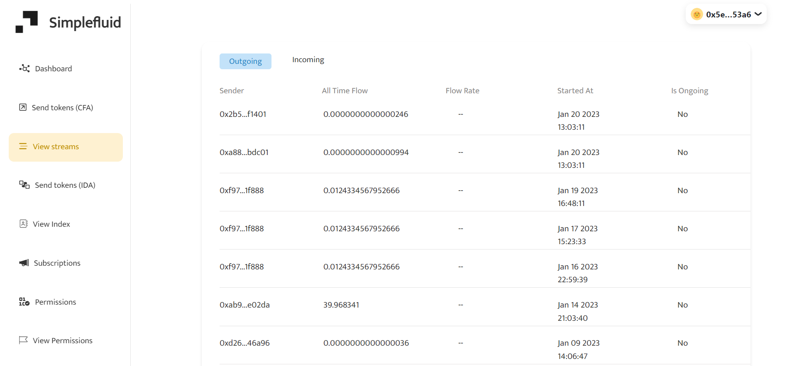
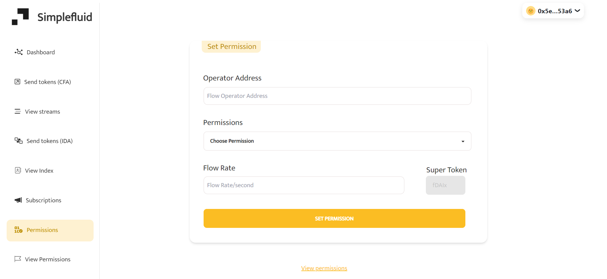

<h1 align = "center">Simplefluid 🪙</h1>

There are just so many things that we can do now with the idea of programmable money. While Superfluid is achieving something extra ordinary by flowing money in real time. Simplefluid allows you to manage all of your superfluid transactions in one place and in just a click of a button. Be it superfluid streams or managing your superfluid permissions or automating your streams Simplefluid has it all. Simplefluid offers a very minimal and simple design that almost anyone can use to stream their money. Simplefluid unlocks the full power of superfluid and also allows you to do so many things. Here are all the things written below that you can do with simplefluid.

 
 

## Features :

<ul>
<li>Stream your tokens (even to multiple users in a single transaction)</li>
<li>View all of the streams you ever created</li>
<li>Send money to your subscribers via Instant Distribution Agreement</li>
<li>View all of your index and update them anytime</li>
<li>Approve and Revoke your subscriptions</li>
<li>Allow someone else to create/update/delete streams for you (ACL)</li>
<li>Automate your token streams using Superfluid stream scheduler</li>
</ul>

 
 

## 🌞 Screenshots

 
 

 
 

 
 

 
 

 
 

 
 

 
 

 
 

 
 

## 👩‍🔧 Contributing

To start contributing make sure you have <a href = "https://nodejs.org/en/download/">Nodejs</a> and <a href = "https://git-scm.com/">Git</a> installed in your system.

 After installing following requirements, perform the following steps -

 - Fork the repository.
 - Clone the repository using `git clone <repository-url>`
 - Create a new branch using `git checkout -b <branch-name>`
 - Change the directory to app using `cd <dirname>`
 - Install dependencies using `npm install`
 - Run the app using `npm run dev or node app.js`
 - Once you are done making your changes stage your changes using `git add .`
 - Commit your changes using `git commit -m "message"`
 - Push your changes to the remote repository using `git push origin <branch-name>`

 
Note: Making any changes to the smart contract is not allowed currently because of the immutable nature of smart contracts. To submit any changes smart contracts needs to be redeployed that will result in loosing all the previous data.

 
 

## 🤔 Bug Reports/Feature Requests

Kindly open an issue if you face any king of bug or any other kind of problem by going to the issues tab and clicking on new issue. You can also request for a new feature by opening a new issue.

## Support

Kindly support me if you like the project by starring 🌟 the project. It'll be much appreciated 😄.